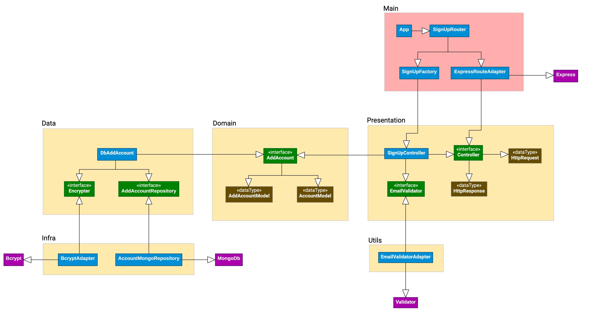

# 🏗 Arquitetura Limpa com TypeScript
> Uma API simples, robusta, flexível, e com baixo acoplamento construída com TDD e Clean Architecture

[🇺🇸 Read in English](README.md)

Projeto construído para mostrar aos leitores um exemplo prático do TDD e Clean
Architecture aplicados na prática. O resultado desses princípios aplicados juntos
é uma API com baixo acoplamento, fácil de dar manutenção e estender o comportamento.

Atualmente, a API apenas recebe dados simples de um usuário para criar uma conta.

Apesar do funcionamento simples, há uma sólida estrutura aplicada ao projeto, o que deixa
a porta aberta para qualquer sistema ser construído a partir deste, independente de
frameworks específicos. Para exemplificar, eu escolhi MongoDB para persistência de dados,
mas é possível substituí-lo facilmente por qualquer outro banco de dados de sua preferência.

Esta liberdade de escolha e mudança é crucial para aplicações críticas.

---

## 🖼 Diagrama da Arquitetura


---

## 🚀 Executando o projeto
Você precisará de uma URI válida de conexão com um banco de dados MongoDB, ou uma instância
rodando localmente. Se você tem uma instância remota, forneça a URI através da variável de
ambiente`MONGO_URL` quando for executar o projeto.

Se desejar rodar uma instância localmente, é possível através do Docker:
`docker run --name mongodb -p 27017:27017 -d mongo`. Com o container em execução, a API será
capaz de se conectar automaticamente. Não é necessário realizar nenhuma ação ou configuração.

Feito isso, basta instalar as dependências do projeto com `yarn` ou `npm`, e executar o script
de inicialização via `yarn run start` ou `npm run start`. O servidor ficará disponível na URL
http://localhost:8080. Para alterar a porta padrão, forneça a variável de ambiente _PORT_, ou
altere o arquivo `src/main/config/env.ts`.

---

## 🧪 Executando testes
Este projeto conta com 100% de cobertura de testes. Para rodar os testes unitários, execute o
script `test:unit` via _yarn_ ou _npm_. Para rodar os testes de integração, execute o script
`test:integration`. Para rodar todos os testes de uma só vez, execute o script `test`.

---

## 📃 Endpoints
### POST `/api/signup`
Cria uma nova conta de usuário, criptografa a senha, e devolve o ID gerado.

Parâmetros obrigatórios:
- name: `string` | Nome e sobrenome do usuário
- email: `string` | E-mail válido do usuário
- password: `string` | Senha do usuário

Exemplo de requisição:
```json
{
    "name": "Ryan Ribeiro",
    "email": "test@ryanribeiro.dev",
    "password": "12345678"
}
```

Exemplo de resposta:
```json
{
    "id": "6342326f411dc2273fc65413",
    "name": "Ryan Ribeiro",
    "email": "test@ryanribeiro.dev"
}
```
