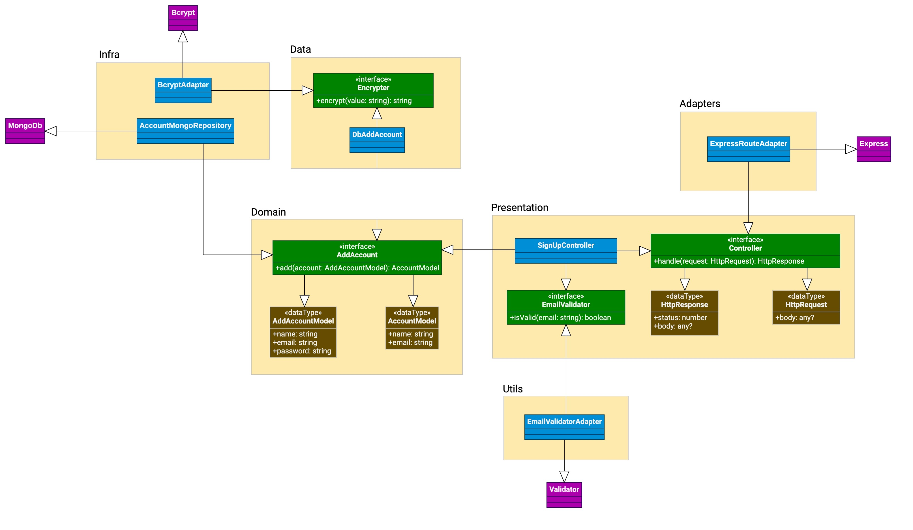

# 🏗 TypeScript Clean Architecture
> A simple yet robust, flexible, loose coupled API built with TDD and Clean Architecture.

[🇧🇷 Leia em português](README-pt.md)

Project built to give readers a practical example of TDD and Clean Architecture.
The result of those principles applied together is a loose coupled API, easy to
maintain and extend its behavior.

Currently, this API can only receive simple user data to create an account.

Despite the simple behavior, there is a solid structure applied to it, which leaves the
door open to any system be built upon this one, regardless of framework implementations.
To exemplify this scenario, although I chose MongoDB for data persistence, you can easily
switch to any database of your choice.

This freedom of change and choice is crucial for critical enterprise applications.

---

## 🖼 Architecture Diagram


---

## 🚀 Running the project
You'll need a valid MongoDB connection URL, or a locally running instance. If you have a
remote instance, just provide the connection URI via the `MONGO_URL` environment variable
when executing the project.

If you want to run a local instance of MongoDB, you can easily do so via docker:
`docker run --name mongodb -p 27017:27017 -d mongo`. With the container up and running, the
API will be able to automatically connect to it. No further actions are necessary.

After that, just install the project dependencies with `yarn` or `npm`, then run the start script with
`yarn run start` or `npm run start`. The server will be available at http://localhost:8080.
To change the default server port, either provide the _PORT_ environment variable, or
change the `src/main/config/env.ts` file.

---

## 🧪 Running tests
This project features 100% test coverage. To run unit tests, execute the `test:unit` script
with _yarn_ or _npm_. To run integration tests, execute the `test:integration` script. If you want
to run all tests at once, just run the `test` script.

---

## 📃 Endpoints
### POST `/api/signup`
Creates a new user account, securely hashes the password, and gives back the newly generated user ID.

Required body params:
- name: `string` | User's first and last name
- email: `string` | User's e-mail
- password: `string` | User's password

Sample request:
```json
{
    "name": "Ryan Ribeiro",
    "email": "test@ryanribeiro.dev",
    "password": "12345678"
}
```

Sample response:
```json
{
    "id": "6342326f411dc2273fc65413",
    "name": "Ryan Ribeiro",
    "email": "test@ryanribeiro.dev"
}
```
